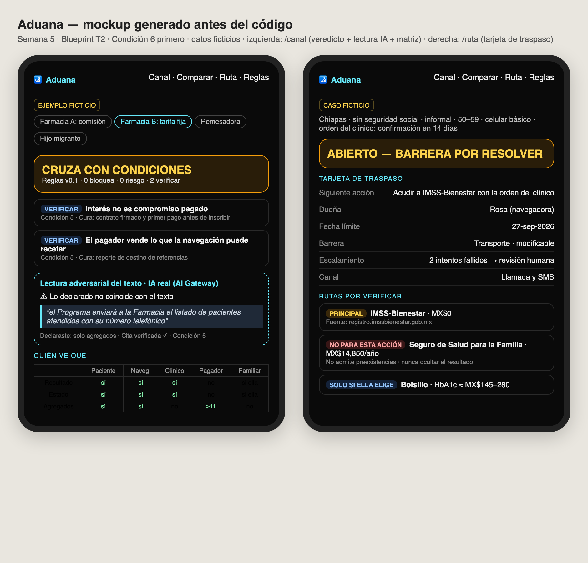
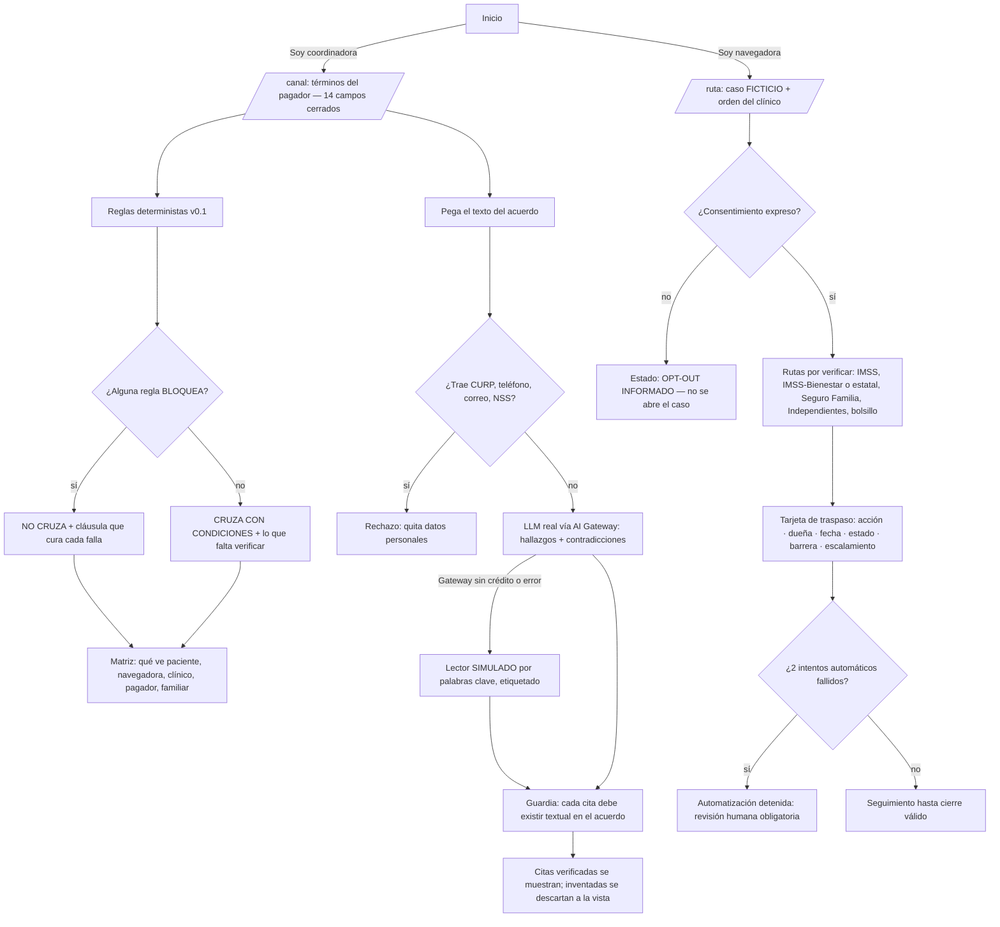
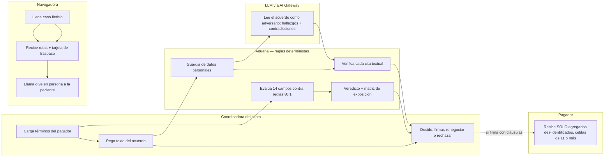

# Packet — w05-aduana · "Aduana: nada cruza sin revisión"

> Escrito ANTES del código (disciplina del curso). Semana 5 · Capítulo 4 "Contactless Love" · T2 · lente ADVERSARY · Andrés Álvarez Morphy Namnum.
> Blueprint T2 (2026-09-12; presentes 3 de 5: Emiliano Technologist · Santiago Operator · Andrés Adversary; sin User ni Money): vacío primario = **NAVEGACIÓN detección → tratamiento**.
> Mi declaración, textual: *"Build an adversarial channel/payer and eligibility checklist, testing conflicts, data exposure, and pharmacy versus remittance incentives; chiefly honors Condition 6."*

## El problema, en mis palabras

El piloto del Blueprint (una farmacia, 30 días, hasta 100 adultos con tamizaje anormal de diabetes tipo 2) puede traicionar a la paciente **antes** de navegarla, en dos momentos:

1. **Cuando acepta dinero.** El pagador propuesto por el equipo es una organización de farmacias: el canal cuyo consultorio adyacente sobreprescribe al 64% y cuyo médico cobra de lo que la farmacia vende. El pagador que yo defiendo es la remesa, y la ventanilla donde se cobra pertenece a grupos que también venden la póliza que paga MX$50 mil si le diagnostican cáncer. Cualquiera de los dos, mal escrito, convierte la navegación en embudo de ventas o en expediente de preexistencia (CONDUSEF cuenta como preexistente hasta "gastos comprobables para diagnosticar"; la Ley sobre el Contrato de Seguro obliga a declarar lo que "debía saber").
2. **Cuando la navegadora la manda a una ventanilla.** El Seguro de Salud para la Familia del IMSS cuesta MX$14,850 al año entre 50 y 59 años, se paga por adelantado, no devuelve cuotas y no admite preexistencias ni tratamientos crónicos de control permanente. La incorporación voluntaria de independientes cuesta MX$20,538.59 al año y exige un cuestionario médico verídico. Ocho estados no están en IMSS-Bienestar. Una ruta prometida sin verificar es un viaje perdido y un mes perdido; una ruta que "funciona" escondiendo el resultado es un fraude contra ella.

En Estados Unidos, alguien revisa estos arreglos antes de que dañen: la OIG (Anti-Kickback: el *safe harbor* de "patient engagement and support" de 2020 excluye explícitamente a fabricantes y distribuidores de medicamentos), HIPAA (de-identificación) y CMS (ninguna celda de 1 a 10 se publica). En México nadie lo hace. El piloto tiene que revisarse a sí mismo. **Aduana es esa revisión, corrida antes de firmar con un pagador y antes de cada traspaso.**

**Qué espera mata (Ley de Latencia):** el viaje perdido, es decir, las semanas entre "detectada" y "llegar a la ventanilla correcta con los papeles correctos". Río arriba mata también los meses entre firmar un acuerdo con conflicto y descubrir ese conflicto en el daño a una paciente.

## Usuario exacto

- **La coordinadora del piloto de navegación** (el asiento del Operator en el piloto del Blueprint): decide si acepta los términos de un pagador. No es abogada. Lee en el celular.
- **La navegadora** (humana, con nombre): antes de un traspaso, verifica ruta, documentos y costo de un caso.
- **Nunca la paciente.** Aduana no le habla a la paciente ni le escribe mensajes (Condición 3: nada de persuasión por IA).
- Persona para la prueba sintética: **"Lupita Méndez"**, 38, enfermera general, coordina el piloto en una farmacia de Tuxtla Gutiérrez, Chiapas. Lee contratos en el celular entre turnos, nunca ha usado IA para trabajar, desconfía de la letra chiquita pero se cansa con textos largos, y si no entiende un término lo ignora en silencio.

## Definición de éxito

**Antes de que cierre el módulo**, en la URL viva, sin cuenta y sin que nada se guarde:
1. En `/canal`, la coordinadora carga los términos de un pagador (ejemplo o propios) y en menos de 3 minutos recibe un **veredicto por reglas** (NO CRUZA / CRUZA CON CONDICIONES). Cada hallazgo va atado a una condición del Blueprint, con su fuente y la cláusula que lo cura, más la **matriz de quién ve qué**.
2. En `/canal`, al pegar el texto del acuerdo (≤ 4,000 caracteres), recibe una **lectura adversarial por un LLM real vía Vercel AI Gateway**. Cada cita se verifica textualmente contra lo pegado y se descarta si no aparece. Si el Gateway no responde, la página muestra una lectura **SIMULADA y etiquetada** y nunca se rompe.
3. En `/comparar`, **farmacia vs remesa vs hijo migrante** aparecen lado a lado contra las mismas reglas.
4. En `/ruta`, la navegadora llena un caso **ficticio** y recibe rutas por verificar (con costo y fuente), documentos faltantes y la **tarjeta de traspaso**: Siguiente acción · Dueña · Fecha límite · Estado · Barrera · Escalamiento.

## Mockup (generado)

*Intenté generarlo con un modelo de imagen vía AI Gateway; el Gateway respondió `403 customer_verification_required` porque el equipo class19 no tiene tarjeta registrada. Lo generé por código (HTML → Playwright) antes de escribir la app, como en la semana 4.*

## Flujo

## Benchmark

**La mejor solución existente en el mundo para esto es** la revisión de arreglos de EE.UU.: la OIG decide si quien paga el apoyo al paciente está comprando referencias (Anti-Kickback Statute; el *safe harbor* 42 CFR 1001.952(hh) de 2020 excluye a fabricantes y distribuidores de medicamentos), y HIPAA más la política de supresión de celdas de CMS (nada de 1 a 10) definen qué puede recibir un tercero. **La mía se diferencia/localiza en que** en México no hay revisor, así que la regla la corre el propio piloto antes de firmar: en español, contra los pagadores que de verdad existen aquí (cadena con consultorio adyacente, remesadora cuyo grupo vende seguros y crédito, hijo migrante que paga desde Texas). Además agrega lo que la OIG no mira: la exposición a aseguradoras por preexistencia (CONDUSEF, LCS art. 8) y el trabajo no pagado de la hija.

## Vista larga (3 oraciones)

Si esta rebanada funciona, en tres años Aduana es la revisión que cualquier piloto de navegación o tamizaje en México corre antes de aceptar dinero de una cadena de farmacias, una remesadora o una tienda con abono: un reglamento público y versionado cuyo "sello" un patrocinador solo obtiene firmando las cláusulas que curan. El mapa de rutas de `/ruta` se vuelve el mapa compartido de elegibilidad, fechado y con fuente, que mantienen las navegadoras de campo en lugar de cada una redescubrir la ventanilla. Los muros de carga son: las reglas son públicas, el LLM nunca decide el veredicto, ningún patrocinador paga por cambiar una regla y el producto no guarda datos personales.

## Recorte de alcance (lo que NO construyo esta semana)

- **Nada se guarda.** Sin cuentas, sin base de datos, sin pacientes reales: todos los casos y pagadores son ficticios y así se etiquetan.
- **Sin puntaje de riesgo, sin tamizaje, sin interpretar resultados** (Condición 1). El resultado entra como la orden que ya dio el clínico del proveedor. (Esto retira la idea tipo FINDRISC de mi brief: el Blueprint prohíbe un modelo de riesgo en el MVP.)
- **El LLM no le habla a pacientes ni les redacta mensajes** (Condición 3). El modelo lee contratos, nunca personas.
- **No es opinión legal.** Donde la pregunta es jurídica (¿un probable mostrado cuenta como "debía saber"?), el hallazgo dice "llevar a abogado".
- **Sin nombres reales de empresas** en los ejemplos: son arquetipos inventados ("Cadena farmacéutica A", "Remesadora de grupo financiero"), para no hacerse pasar por nadie ni difamar a nadie.
- Sin envío automático, sin WhatsApp integrado, sin agenda de citas.
- El mapa de rutas cubre IMSS vigente, IMSS-Bienestar o servicios estatales, Seguro de Salud para la Familia, incorporación voluntaria de independientes y bolsillo; ISSSTE y otras instituciones solo como "verificar con su institución".

## Condiciones del Blueprint → cómo las honra el build

| Condición | Cómo |
|---|---|
| 1. Frontera clínica | Sin modelo de riesgo. El resultado entra como orden del clínico; casos ficticios etiquetados en cada pantalla. |
| 2. Traspaso con dueña | Tarjeta con Siguiente acción · Dueña · Fecha límite · Estado · Barrera · Escalamiento. Sin dueña con nombre, el caso no se abre. Nunca existe el estado "entregado = éxito"; lo aceptado sin resolver sigue NO RESUELTO. |
| 3. Escalamiento humano | Con 2 intentos automáticos fallidos sobre la misma acción → "Automatización detenida: revisión humana obligatoria". El LLM nunca contacta pacientes. |
| 4. Acceso honesto | Rutas "POR VERIFICAR" con fuente y fecha, costo visible, estado "NO RESUELTO — BARRERA FINANCIERA/CAPACIDAD". Regla explícita: nunca ocultar un resultado conocido para entrar a un seguro. Afiliarse no es requisito universal. |
| 5. Operación financiada y medible | Reglas: pago independiente de ventas de medicamentos o pruebas; "interés" ≠ "contrato pagado"; métricas = acciones completadas y minutos de navegadora, no alertas enviadas. |
| **6. CLÁUSULA SOMBRA** | Matriz de exposición por actor. El pagador (incluido el hijo migrante) recibe solo agregados des-identificados con celdas ≥ 11, nunca señales personales. Familia solo con consentimiento de la paciente y sin tareas asignadas. Ruta sin smartphone obligatoria. Consentimiento expreso y por escrito (LFPDPPP 2025, datos sensibles). Guardia de datos personales antes del LLM. |

## Arquitectura y stack

| Capa | Elección | Por qué |
|---|---|---|
| Framework | Next.js 15 (App Router, JS) + Tailwind 4 | plantilla del curso |
| Señal estructurada | Hoja de términos del pagador (14 campos cerrados, `lib/reglas.js`) + caso ficticio (`lib/ruta.js`) | piso de stack "LLM + señal estructurada"; reglas deterministas y reproducibles |
| Reglas | `lib/reglas.js`: cada regla = id, condición, severidad (BLOQUEA / RIESGO / VERIFICAR), prueba, por qué, fuente, cláusula que cura; públicas en `/reglas` v0.1 | el veredicto se puede auditar, igual que la rúbrica pública de Criba |
| LLM | AI SDK 7 `generateText` + `Output.object` (zod) → `anthropic/claude-sonnet-5` vía **Vercel AI Gateway**, autenticado por OIDC (sin llave en el repo) | lee el texto del acuerdo como adversario; **nunca decide el veredicto** |
| Anti-alucinación | cada `cita` debe aparecer textual (normalizando espacios) en lo pegado; si no, se descarta y se muestra como descartada | un adversario sin fuente es opinión (regla de mi brief) |
| Guardia de datos | `lib/pii.js`: CURP, RFC, NSS, teléfono de 10 dígitos, correo → 400 antes del LLM | Condición 6 (minimizar) + piso de seguridad |
| Respaldo | si el Gateway falla → lector SIMULADO por palabras clave, etiquetado con la razón | la URL funciona aunque el equipo no tenga crédito |
| Persistencia | ninguna | sin datos personales → no se necesitan auth ni RLS |
| Hosting | Vercel (equipo `class19`) | |

## Piso de seguridad

1. **Secretos:** ninguno en el repo; el Gateway usa el token OIDC que Vercel inyecta; `.env.local` está en .gitignore. 2. **Auth:** no aplica porque nada se guarda, y la pantalla lo dice. 3. **RLS:** no aplica (sin base de datos). 4. **Validación:** zod con enums cerrados y `.strict()`, texto ≤ 4,000 caracteres, guardia de datos personales y límite de 8 lecturas por IP cada 10 minutos (best-effort en memoria). 5. **Datos inventados** y etiquetados en cada pantalla; los pagadores son arquetipos, no empresas reales.

## Plan de prueba

**Mecánico** (`node --test` sobre `lib/` + `curl` contra local y producción):
- a) Ejemplo "Farmacia A, comisión por receta" → NO CRUZA, con la regla de margen (C5).
- b) "Farmacia B, tarifa fija" (el pagador del Blueprint) → CRUZA CON CONDICIONES, solo con VERIFICAR.
- c) "Remesadora, como la ofrecen" → NO CRUZA (C6 exposición + preexistencia).
- d) "Hijo migrante quiere saber" → NO CRUZA (el pagador ve señal personal).
- e) Texto con un CURP → 400. f) Texto > 4,000 → 400; campo extra → 400.
- g) Guardia de citas: una cita inventada se descarta.
- h) Gateway con 403 → `modo: simulado`, HTTP 200.
- i) `/ruta`: sin seguridad social + Jalisco → servicios estatales, no IMSS-Bienestar; 2 intentos → REVISIÓN HUMANA OBLIGATORIA; barrera costo → NO RESUELTO — BARRERA FINANCIERA; resultado conocido + Seguro Familia → advertencia "no admite preexistencias; nunca ocultar".
- j) Vista de 390 px sin scroll horizontal.

**Persona (Lupita):** capturas de teléfono de inicio → /canal (ejemplo Farmacia B) → veredicto + lectura → /comparar → /ruta, en un chat fresco, como ella. Registrar cada confusión, corregir la peor y redesplegar.
